  

 

<table border="0" cellpadding="14">
  <tr>
    <td valign="top">
      <code>✦ 🎓 Lic. en Ciencia de Datos</code> 
      <code>✦ 🏫 Universidad Austral · Rosario</code> 
      <code>✦ 💻 Aprendiendo Python, R, HTML, CSS, JS y Git</code> 
      <code>✦ 🌅 Atardeceres · 🏐 voley · 📚 libros</code> 
      <code>✦ 🍝 Pastas · 🐶 perros y animales</code> 
      <code>✦ 🤝 Abierta a colaborar en proyectos</code>
    </td>
    <td align="center" valign="middle">
        
      
    </td>
  </tr>
</table>

♡ Gracias por pasar por mi perfil· ♡

